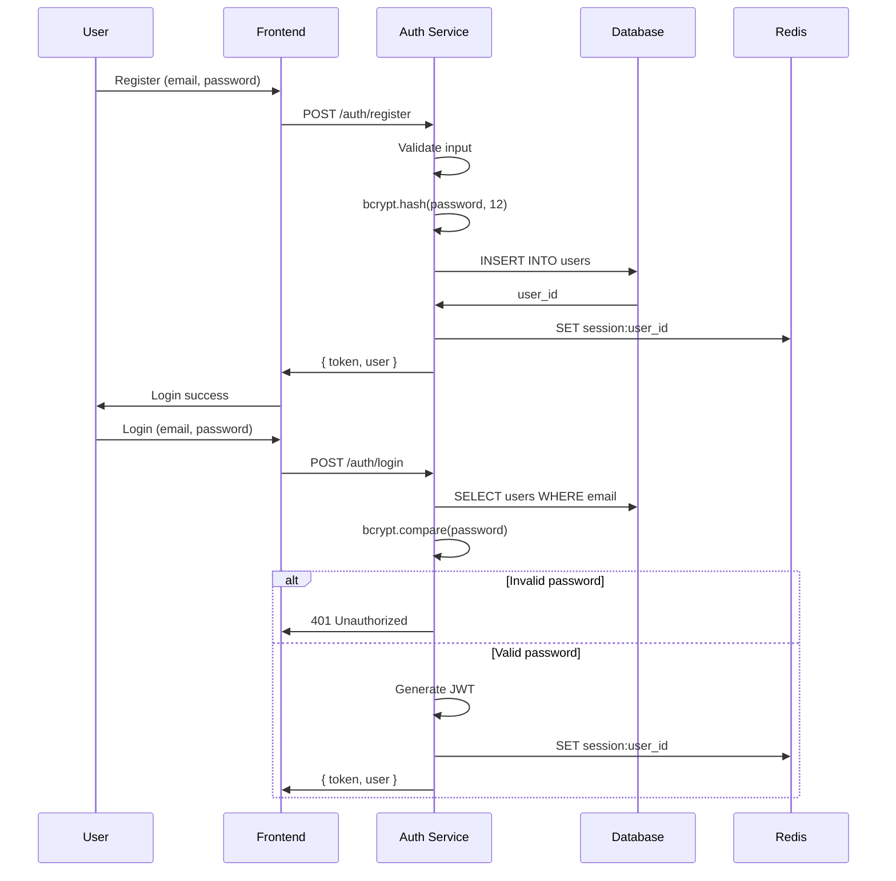

# Module Designs & Flow Charts

## Table of Contents
1. [User Authentication Flow](#1-user-authentication-flow)
2. [Catalog Ingestion Flow](#2-catalog-ingestion-flow)
3. [Transcription Pipeline Flow](#3-transcription-pipeline-flow)
4. [Playlist Generation Flow](#4-playlist-generation-flow)
5. [Search Flow](#5-search-flow)
6. [Data Models](#6-data-models)
7. [API Specifications](#7-api-specifications)

---

## 1. User Authentication Flow

### Flow Chart

```
┌─────────────────────────────────────────────────────────────────────┐
│                     USER AUTHENTICATION FLOW                         │
└─────────────────────────────────────────────────────────────────────┘

  ┌──────────┐     ┌──────────┐     ┌──────────┐     ┌──────────┐
  │  User    │     │  Next.js  │     │   Auth   │     │  User    │
  │  Browser │     │  Frontend │     │  Service │     │  Database │
  └────┬─────┘     └────┬─────┘     └────┬─────┘     └────┬─────┘
       │                │                │                │
       │  1. Register   │                │                │
       │───────────────>│                │                │
       │                │  2. API Call   │                │
       │                │───────────────>│                │
       │                │                │  3. Hash Password
       │                │                │────────────────│
       │                │                │  4. Store User│
       │                │                │───────────────>│
       │                │                │                │ 5. Create
       │                │                │                │◄────────────
       │  6. JWT Token │                │                │
       │<──────────────│                │                │
       │               │                │                │
       │  1. Login     │                │                │
       │──────────────>│                │                │
       │               │  2. API Call  │                │
       │               │───────────────>│                │
       │               │                │  3. Verify Hash│
       │               │                │◄───────────────│
       │               │                │                │
       │               │  4. JWT Token │                │
       │<──────────────│<───────────────                │
       │               │                │                │
       │  Authenticated Requests       │                │
       │───────────────────────────────────────────────│
       │               │                │                │
       │               │  5. Validate JWT              │
       │               │<───────────────                │
       │               │                │                │
       ▼               ▼                ▼                ▼
```

### Sequence Diagram



### State Machine

```
                    ┌─────────────────┐
                    │   UNREGISTERED  │
                    └────────┬────────┘
                             │ Register
                             ▼
              ┌────────────────────────────────┐
              │          START                │
              └────────────────┬───────────────┘
                               │
                ┌──────────────┴──────────────┐
                │  Needs Email Verification   │
                │  (if enabled)              │
                └──────────────┬──────────────┘
                               │
                               │ Login
                               ▼
              ┌────────────────────────────────┐
              │         AUTHENTICATED          │
              │  Can access protected routes   │
              └───────────────┬────────────────┘
                              │
                              │ Token expired / Logout
                              ▼
              ┌────────────────────────────────┐
              │         REFRESH_NEEDED         │
              │  Has refresh token           │
              └───────────────┬────────────────┘
                              │
                              │ Refresh token
                              ▼
              ┌────────────────────────────────┐
              │       AUTHENTICATED           │
              └────────────────────────────────
```

### API Endpoints

| Method | Endpoint | Description | Auth |
|--------|----------|-------------|------|
| POST | `/auth/register` | Register new user | No |
| POST | `/auth/login` | Login | No |
| POST | `/auth/logout` | Logout | Yes |
| POST | `/auth/refresh` | Refresh token | No |
| GET | `/auth/me` | Get current user | Yes |

---

## 2. Catalog Ingestion Flow

### Flow Chart

```
┌─────────────────────────────────────────────────────────────────────┐
│                    CATALOG INGESTION FLOW                           │
└─────────────────────────────────────────────────────────────────────┘

  ┌──────────┐     ┌──────────┐     ┌──────────┐     ┌──────────┐
  │  Apple   │     │ Ingestor │     │ Dedupe   │     │  Topic   │
  │ Podcasts │     │ Service  │     │ Service  │     │  Filter  │
  │   API    │     │          │     │          │     │          │
  └────┬─────┘     └────┬─────┘     └────┬─────┘     └────┬─────┘
       │                │                │                │
       │  1. Fetch RSS │                │                │
       │<───────────────│                │                │
       │                │                │                │
       │  2. Parse     │                │                │
       │────────────────│                │                │
       │                │  3. Extract Episodes           │
       │                │────────────────│                │
       │                │                │  4. Deduplicate│
       │                │                │◄───────────────│
       │                │                │                │
       │                │  5. New Episodes              │
       │                │────────────────>                │
       │                │                │  6. Filter by│
       │                │                │     Topics    │
       │                │                │◄───────────────│
       │                │                │                │
       │                │  7. Queue for Processing      │
       │                │────────────────────────────────│
       │                │                │                │  8. Message
       │                │                │                │     Queue
       │                │                │                │◄────────────
       │                │                │                │
       ▼                ▼                ▼                ▼
```

### Detailed Pipeline

```
┌─────────────────────────────────────────────────────────────────────┐
│                   INGESTION PIPELINE (DETAILED)                      │
└─────────────────────────────────────────────────────────────────────┘

  ┌──────────────────────────────────────────────────────────────────┐
  │  STEP 1: FETCH EPISODES                                        │
  │  ┌─────────────────────────────────────────────────────────────┐ │
  │  │ for each topic in TOP_10_TOPICS:                         │ │
  │  │   response = apple_api.search(term=topic)                │ │
  │  │   episodes.extend(response.results)                      │ │
  │  └─────────────────────────────────────────────────────────────┘ │
  └──────────────────────────────────────────────────────────────────┘
                                    │
                                    ▼
  ┌──────────────────────────────────────────────────────────────────┐
  │  STEP 2: DEDUPLICATE                                           │
  │  ┌─────────────────────────────────────────────────────────────┐ │
  │  │ seen_urls = set()                                         │ │
  │  │ unique_episodes = []                                      │ │
  │  │ for episode in all_episodes:                              │ │
  │  │   if episode.url not in seen_urls:                       │ │
  │  │       seen_urls.add(episode.url)                          │ │
  │  │       unique_episodes.append(episode)                     │ │
  │  └─────────────────────────────────────────────────────────────┘ │
  └──────────────────────────────────────────────────────────────────┘
                                    │
                                    ▼
  ┌──────────────────────────────────────────────────────────────────┐
  │  STEP 3: FILTER BY TOPIC                                       │
  │  ┌─────────────────────────────────────────────────────────────┐ │
  │  │ for episode in unique_episodes:                            │ │
  │  │   relevance = calculate_relevance(                         │ │
  │  │       episode, TOP_10_TOPICS                               │ │
  │  │   )                                                        │ │
  │  │   if relevance > THRESHOLD:                               │ │
  │  │       queue_for_processing.append(episode)                │ │
  │  └─────────────────────────────────────────────────────────────┘ │
  └──────────────────────────────────────────────────────────────────┘
                                    │
                                    ▼
  ┌──────────────────────────────────────────────────────────────────┐
  │  STEP 4: QUEUE FOR PROCESSING                                   │
  │  ┌─────────────────────────────────────────────────────────────┐ │
  │  │ for episode in queue_for_processing:                       │ │
  │  │   rabbitmq.publish(                                        │ │
  │  │       exchange='catalog',                                  │ │
  │  │       routing_key='transcription',                         │ │
  │  │       body=episode.json()                                  │ │
  │  │   )                                                        │ │
  │  └─────────────────────────────────────────────────────────────┘ │
  └──────────────────────────────────────────────────────────────────┘
                                    │
                                    ▼
  ┌──────────────────────────────────────────────────────────────────┐
  │  STEP 5: PROCESSING WORKERS (Parallel)                          │
  │                                                                  │
  │  ┌─────────────┐  ┌─────────────┐  ┌─────────────┐            │
  │  │ Transcriber │  │ Summarizer  │  │ Embedding   │            │
  │  │   Worker    │  │   Worker    │  │   Worker    │            │
  │  └──────┬──────┘  └──────┬──────┘  └──────┬──────┘            │
  │         │                 │                 │                    │
  │         └─────────────────┴─────────────────┘                    │
  │                           │                                     │
  │                           ▼                                     │
  │                  ┌─────────────────┐                            │
  │                  │ Vector Database │                            │
  │                  │    (Pinecone)  │                            │
  │                  └─────────────────┘                            │
  └──────────────────────────────────────────────────────────────────┘
```

### Daily Schedule

```
┌─────────────────────────────────────────────────────────────────────┐
│                        DAILY INGESTION SCHEDULE                      │
└─────────────────────────────────────────────────────────────────────┘

  12:00 AM  ─────────────────────────────────────────────────────────
              │ 5. QMD Reindex (every 6 hours)
              │
  2:00 AM   ─────────────────────────────────────────────────────────
              │ 1. Fetch new episodes from Apple Podcasts
              │ 2. Deduplicate (compare against last 30 days)
              │ 3. Filter by topic keywords
              │ 4. Queue ~5,000 episodes
              │
  2:30 AM   ─────────────────────────────────────────────────────────
              │ 5. Transcription workers start
              │
  6:00 AM   ─────────────────────────────────────────────────────────
              │ 6. All transcripts complete
              │ 7. Generate embeddings
              │ 8. Index in vector DB
              │
  8:00 AM   ─────────────────────────────────────────────────────────
              │ 9. Fresh playlist available for users
              │
  Every 6 hrs
              │ 10. Incremental update (new episodes only)
```

---

## 3. Transcription Pipeline Flow

### Flow Chart (Beta - whisper.cpp)

```
┌─────────────────────────────────────────────────────────────────────┐
│              BETA TRANSCRIPTION FLOW (whisper.cpp)                  │
└─────────────────────────────────────────────────────────────────────┘

  ┌──────────┐     ┌──────────┐     ┌──────────┐     ┌──────────┐
  │ Message  │     │ Download │     │whisper.  │     │  Store   │
  │  Queue   │     │  Audio   │     │   cpp    │     │Transcript│
  └────┬─────┘     └────┬─────┘     └────┬─────┘     └────┬─────┘
       │                │                │                │
       │  1. Get URL    │                │                │
       │<───────────────│                │                │
       │                │                │                │
       │                │  2. Download MP3                 │
       │                │─────────────────────────────────>│
       │                │                │                │
       │                │  3. File Ready │                │
       │                │<─────────────────────────────────│
       │                │                │                │
       │                │  4. Run whisper.cpp             │
       │                │─────────────────────────────────>│
       │                │                │                │
       │                │  5. transcript.txt              │
       │                │<─────────────────────────────────│
       │                │                │                │
       │                │  6. Upload to S3               │
       │                │─────────────────────────────────>│
       │                │                │                │
       │                │  7. Update Episode Record      │
       │                │─────────────────────────────────>│
       │                │                │                │
       │                │  8. Delete MP3 (save space)    │
       │                │─────────────────────────────────│
       │                │                │                │
       ▼                ▼                ▼                ▼
```

### Processing Time Estimates

| Model | Size | Speed | Accuracy | Use Case |
|-------|------|-------|----------|----------|
| base.en | 74 MB | ~2x realtime | Good | Beta (fastest) |
| small | 244 MB | ~1.5x realtime | Better | Production |
| medium | 769 MB | Realtime | Best | High accuracy |

---

## 4. Playlist Generation Flow

### Flow Chart

```
┌─────────────────────────────────────────────────────────────────────┐
│                   PLAYLIST GENERATION FLOW                          │
└─────────────────────────────────────────────────────────────────────┘

  ┌──────────┐     ┌──────────┐     ┌──────────┐     ┌──────────┐
  │  User    │     │Playlist  │     │  User    │     │ Vector   │
  │  Request │     │ Service  │     │ Service  │     │   DB     │
  └────┬─────┘     └────┬─────┘     └────┬─────┘     └────┬─────┘
       │                │                │                │
       │  1. GET      │                │                │
       │     /playlist│                │                │
       │───────────────>│                │                │
       │               │  2. Get User Topics           │
       │               │────────────────────────────────>│
       │               │                │                │
       │               │  3. Get Topic Embeddings      │
       │               │<────────────────────────────────│
       │               │                │                │
       │               │  4. Query Vector DB           │
       │               │────────────────────────────────>│
       │               │                │                │
       │               │  5. Top 100 Episodes          │
       │               │<────────────────────────────────│
       │               │                │                │
       │               │  6. Score & Filter            │
       │               │  ┌──────────────────────┐     │
       │               │  │ - Relevance × Date  │     │
       │               │  │ - Remove listened   │     │
       │               │  │ - Max 1 per show   │     │
       │               │  └──────────────────────┘     │
       │               │                │                │
       │               │  7. Return Playlist          │
       │               │<───────────────               │
       │               │                │                │
       │  8. JSON     │                │                │
       │<─────────────│                │                │
       │               │                │                │
       ▼               ▼                ▼                ▼
```

### Scoring Algorithm

```
┌─────────────────────────────────────────────────────────────────────┐
│                    PLAYLIST SCORING ALGORITHM                       │
└─────────────────────────────────────────────────────────────────────┘

  Episode Score = (Relevance_Score × 0.7) + (Recency_Score × 0.3)

  where:

  Relevance_Score = cosine_similarity(user_embedding, episode_embedding)

  Recency_Score = 1 / (1 + 0.1 × days_since_published)

  ───────────────────────────────────────────────────────────────────

  FILTERING RULES:

  1. REMOVE_LISTENED
     for episode in candidate_episodes:
         if episode.id in user.history:
             exclude

  2. DIVERSIFY_SHOWS
     max_1_per_show = True
     seen_shows = set()
     for episode in sorted_episodes:
         if episode.show_id not in seen_shows:
             include
             seen_shows.add(episode.show_id)
```

---

## 5. Search Flow

### Flow Chart

```
┌─────────────────────────────────────────────────────────────────────┐
│                       SEARCH FLOW                                    │
└─────────────────────────────────────────────────────────────────────┘

  ┌──────────┐     ┌──────────┐     ┌──────────┐     ┌──────────┐
  │  User    │     │  Search   │     │  Query   │     │ Vector   │
  │  Input   │     │  Service  │     │ Processor│     │   DB     │
  └────┬─────┘     └────┬─────┘     └────┬─────┘     └────┬─────┘
       │                │                │                │
       │  1. "bad bunny│                │                │
       │     nfl"      │                │                │
       │───────────────>│                │                │
       │               │                │                │
       │               │  2. Parse Query               │
       │               │────────────────────────────────>│
       │               │                │                │
       │               │                │  3. Extract Entities
       │               │                │     "bad bunny" → [music, artist]
       │               │                │     "nfl" → [sports, football]
       │               │                │                │
       │               │                │  4. Generate Query Embedding
       │               │                │────────────────────────────────│
       │               │                │                │  5. Embedding
       │               │                │                │◄───────────────
       │               │                │                │
       │               │                │  6. Hybrid Search
       │               │                │────────────────────────────────│
       │               │                │                │
       │               │                │  7. BM25 + Vector Results     │
       │               │                │<────────────────────────────────│
       │               │                │                │
       │               │  8. Rerank Results          │
       │               │────────────────────────────────>│
       │               │                │                │
       │               │                │  9. Reranked Results         │
       │               │                │<────────────────────────────────│
       │               │                │                │
       │               │  10. Return Results         │
       │               │<───────────────               │
       │               │                │                │
       │  11. JSON    │                │                │
       │<─────────────│                │                │
       │               │                │                │
       ▼               ▼                ▼                ▼
```

### Hybrid Search Architecture

```
┌─────────────────────────────────────────────────────────────────────┐
│                    HYBRID SEARCH ARCHITECTURE                        │
└─────────────────────────────────────────────────────────────────────┘

  User Query: "bad bunny nfl halftime show"

  ┌─────────────────────────────────────────────────────────────────┐
  │                        STEP 1: KEYWORD SEARCH (BM25)           │
  │  ┌─────────────────────────────────────────────────────────────┐ │
  │  │ Search in:                                               │ │
  │  │   - Episode titles                                       │ │
  │  │   - Episode descriptions                                │ │
  │  │   - Show names                                          │ │
  │  │                                                         │ │
  │  │ Results:                                                 │ │
  │  │   - "Bad Bunny NFL Halftime" → 0.85                     │ │
  │  │   - "Bad Bunny Interview" → 0.72                        │ │
  │  │   - "Super Bowl Halftime Show" → 0.68                   │ │
  │  └─────────────────────────────────────────────────────────────┘ │
  └─────────────────────────────────────────────────────────────────┘
                                    │
                                    ▼
  ┌─────────────────────────────────────────────────────────────────┐
  │                     STEP 2: SEMANTIC SEARCH                    │
  │  ┌─────────────────────────────────────────────────────────────┐ │
  │  │ Query: "bad bunny nfl halftime show"                     │ │
  │  │                                                         │ │
  │  │ Find episodes with similar meaning:                       │ │
  │  │   - Bad Bunny songs on podcasts → 0.92                  │ │
  │  │   - NFL halftime controversy → 0.89                      │ │
  │  │   - Latin music industry → 0.85                          │ │
  │  └─────────────────────────────────────────────────────────────┘ │
  └─────────────────────────────────────────────────────────────────┘
                                    │
                                    ▼
  ┌─────────────────────────────────────────────────────────────────┐
  │                    STEP 3: FUSION & RERANK                    │
  │  ┌─────────────────────────────────────────────────────────────┐ │
  │  │                                                         │ │
  │  │ final_score = 0.4 × bm25_score + 0.6 × semantic_score   │ │
  │  │                                                         │ │
  │  │ After Fusion:                                           │ │
  │  │   1. Bad Bunny NFL Halftime (0.88)                     │ │
  │  │   2. Bad Bunny Songs Compilation (0.85)               │ │
  │  │   3. NFL Halftime Controversy (0.82)                  │ │
  │  │   4. Bad Bunny Interview (0.80)                        │ │
  │  │   5. Latin Music Industry Update (0.78)               │ │
  │  │                                                         │ │
  │  └─────────────────────────────────────────────────────────────┘ │
  └─────────────────────────────────────────────────────────────────┘
```

---

## 6. Data Models

### User Model (PostgreSQL)

```sql
-- Users table
CREATE TABLE users (
    id UUID PRIMARY KEY DEFAULT gen_random_uuid(),
    email VARCHAR(255) UNIQUE NOT NULL,
    password_hash VARCHAR(255) NOT NULL,
    name VARCHAR(255),
    created_at TIMESTAMP WITH TIME ZONE DEFAULT NOW(),
    updated_at TIMESTAMP WITH TIME ZONE DEFAULT NOW(),
    deleted_at TIMESTAMP WITH TIME ZONE
);

-- User topics
CREATE TABLE user_topics (
    id UUID PRIMARY KEY DEFAULT gen_random_uuid(),
    user_id UUID REFERENCES users(id) ON DELETE CASCADE,
    topic_text TEXT NOT NULL,
    embedding VECTOR(384),
    created_at TIMESTAMP WITH TIME ZONE DEFAULT NOW(),
    deleted_at TIMESTAMP WITH TIME ZONE
);

-- User history (listened episodes)
CREATE TABLE user_history (
    id UUID PRIMARY KEY DEFAULT gen_random_uuid(),
    user_id UUID REFERENCES users(id) ON DELETE CASCADE,
    episode_id UUID NOT NULL,
    listened_at TIMESTAMP WITH TIME ZONE DEFAULT NOW(),
    progress_seconds INT DEFAULT 0,
    completed BOOLEAN DEFAULT FALSE,
    UNIQUE(user_id, episode_id)
);
```

### Episode Model (PostgreSQL)

```sql
-- Episodes
CREATE TABLE episodes (
    id UUID PRIMARY KEY DEFAULT gen_random_uuid(),
    external_id VARCHAR(255) UNIQUE NOT NULL,
    show_id UUID NOT NULL,
    show_name VARCHAR(255) NOT NULL,
    
    title VARCHAR(500) NOT NULL,
    description TEXT,
    audio_url VARCHAR(2000) NOT NULL,
    image_url VARCHAR(2000),
    
    publish_date TIMESTAMP WITH TIME ZONE NOT NULL,
    duration_seconds INT,
    explicit BOOLEAN DEFAULT FALSE,
    
    -- Processing status
    transcription_status VARCHAR(50) DEFAULT 'pending',
    transcript_url VARCHAR(2000),
    summary TEXT,
    
    -- Search metadata
    keywords TEXT[],
    topics TEXT[],
    embedding VECTOR(384),
    
    created_at TIMESTAMP WITH TIME ZONE DEFAULT NOW(),
    updated_at TIMESTAMP WITH TIME ZONE DEFAULT NOW()
);

-- Indexes
CREATE INDEX idx_publish_date ON episodes(publish_date DESC);
CREATE INDEX idx_transcription_status ON episodes(transcription_status);
CREATE INDEX idx_show_id ON episodes(show_id);
```

---

## 7. API Specifications

### Playlist Endpoint

```yaml
paths:
  /playlists/daily:
    get:
      summary: Get daily personalized playlist
      security:
        - BearerAuth: []
      parameters:
        - name: limit
          in: query
          schema:
            type: integer
            default: 20
            maximum: 100
        - name: offset
          in: query
          schema:
            type: integer
            default: 0
      responses:
        200:
          description: Daily playlist
          content:
            application/json:
              schema:
                type: object
                properties:
                  data:
                    type: object
                    properties:
                      episodes:
                        type: array
                        items:
                          $ref: '#/components/schemas/Episode'
                      pagination:
                        $ref: '#/components/schemas/Pagination'
```

### Search Endpoint

```yaml
paths:
  /search:
    get:
      summary: Search episodes
      parameters:
        - name: q
          in: query
          required: true
          schema:
            type: string
            example: "bad bunny nfl halftime"
        - name: mode
          in: query
          schema:
            type: string
            enum: [hybrid, keyword, semantic]
            default: hybrid
        - name: limit
          in: query
          schema:
            type: integer
            default: 20
      responses:
        200:
          description: Search results
```

---

## 8. Error Handling Flow

```
┌─────────────────────────────────────────────────────────────────────┐
│                        ERROR HANDLING FLOW                          │
└─────────────────────────────────────────────────────────────────────┘

  ERROR RESPONSE FORMAT:
  {
    "error": {
      "code": "ERROR_CODE",
      "message": "Human readable message",
      "details": {...}
    },
    "request_id": "uuid",
    "timestamp": "2026-02-18T00:30:00Z"
  }

  COMMON ERROR CODES:
  ┌─────────────────┬───────────────────────────────────────────────┐
  │ 400             │ Bad Request - Invalid input                  │
  │ 401             │ Unauthorized - Invalid/missing token         │
  │ 403             │ Forbidden - Insufficient permissions         │
  │ 404             │ Not Found - Resource doesn't exist          │
  │ 429             │ Too Many Requests - Rate limited            │
  │ 500             │ Internal Server Error                       │
  │ 503             │ Service Unavailable - Retry later           │
  └─────────────────┴───────────────────────────────────────────────┘
```

---

## 9. Monitoring Architecture

```
┌─────────────────────────────────────────────────────────────────────┐
│                    MONITORING ARCHITECTURE                          │
└─────────────────────────────────────────────────────────────────────┘

  ┌─────────────────────────────────────────────────────────────────┐
  │                      APPLICATION LOGS                           │
  │  ┌─────────┐  ┌─────────┐  ┌─────────┐  ┌─────────┐          │
  │  │  API    │  │  Auth   │  │Playlist │  │ Search  │          │
  │  │ Service │  │ Service │  │ Service │  │ Service │          │
  │  └────┬────┘  └────┬────┘  └────┬────┘  └────┬────┘          │
  │       │         │         │         │                          │
  │       └─────────┴─────────┴─────────┘                          │
  │                         │                                       │
  └─────────────────────────┼───────────────────────────────────────┘
                            ▼
                    ┌───────────────┐
                    │  Structured   │
                    │  Logging      │
                    │  (JSON)      │
                    └───────┬───────┘
                            │
            ┌───────────────┼───────────────┐
            ▼               ▼               ▼
    ┌─────────────┐ ┌─────────────┐ ┌─────────────┐
    │  Sentry     │ │  Datadog    │ │  Custom     │
    │  (Errors)   │ │  (Metrics)  │ │  Dashboards│
    └─────────────┘ └─────────────┘ └─────────────┘
```

---

## Engineering Review Checklist

| Category | Item | Status | Notes |
|----------|------|--------|-------|
| **Auth** | JWT token security | ✅ | Use short expiry, refresh tokens |
| **Auth** | Password hashing | ✅ | bcrypt cost 12 |
| **Catalog** | Rate limiting | ⚠️ | Need Redis-based rate limiting |
| **Catalog** | Deduplication | ✅ | URL-based dedupe |
| **Transcription** | Storage | ✅ | Delete audio after transcript |
| **Transcription** | Error handling | ⚠️ | Need retry logic |
| **Playlist** | Caching | ✅ | 1-hour Redis TTL |
| **Playlist** | Scoring | ✅ | Relevance × Recency |
| **Search** | Hybrid approach | ✅ | BM25 + Semantic |
| **Search** | Performance | ⚠️ | Need indexing strategy |
| **General** | Circuit breakers | ❌ | Not implemented |
| **General** | Monitoring | ⚠️ | Basic only |
